# RapidRAW plugin for Logi Options+ (MX Creative Console)

Drives [RapidRAW](https://github.com/CyberTimon/RapidRAW)'s develop sliders live from the
MX Creative Console Dialpad, with undo/redo, image navigation, star ratings, colour labels
and view toggles on the Keypad / Actions Ring. Talks to the **external control API** added
in the [RapidRAW fork](https://github.com/jiyang1018/RapidRAW) (branch `external-control`,
protocol in `docs/EXTERNAL_CONTROL_API.md` there): TCP `127.0.0.1:47820`, newline-delimited
JSON, loopback only.

RapidRAW pushes its state to the plugin, so the dials show live values and the preview
follows the dial while you turn it.

## What you need

1. **RapidRAW with external control** — a build of the fork. Its log
   (Settings → Data → View Application Logs) must say
   `External control: listening on 127.0.0.1:47820`.
2. **Logi Options+** with the Logi Plugin Service (installed together with Options+).
3. **The plugin** — either run the [installer](#installer) (nothing else to install), or
   build it yourself, which additionally needs the **.NET 10 SDK** (see
   [Build and sideload](#build-and-sideload)). The .NET SDK is *not* needed when you use
   the installer.

## Set up the console

Start RapidRAW and open an image in the editor, then open Logi Options+. The plugin's
status (Plugins → RapidRAW) flips from "RapidRAW not reachable" to Normal within ~2 s.

The walkthrough below is collapsed to keep the page short, but **it is highly recommended
to expand it** the first time: the actions live a few clicks deep in Options+ and the
screenshots show exactly where.

<details>
<summary><strong>Step by step: assigning RapidRAW actions to the console (click to expand, 7 screenshots)</strong></summary>

**1. First launch.** Options+ with the MX Creative Console selected. RapidRAW gets its
own profile automatically (it activates whenever RapidRAW is the front window); you can
also add the actions to any other profile.

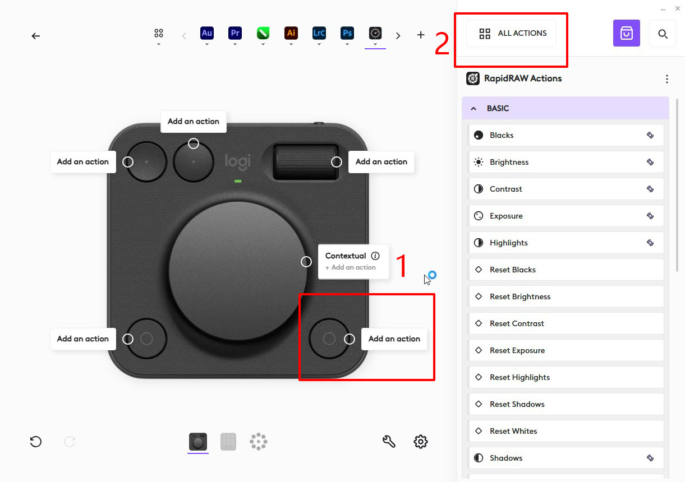

**2. Go to the Dialpad.** Pick the Dialpad (dial, roller and the four buttons) to assign
slider actions.

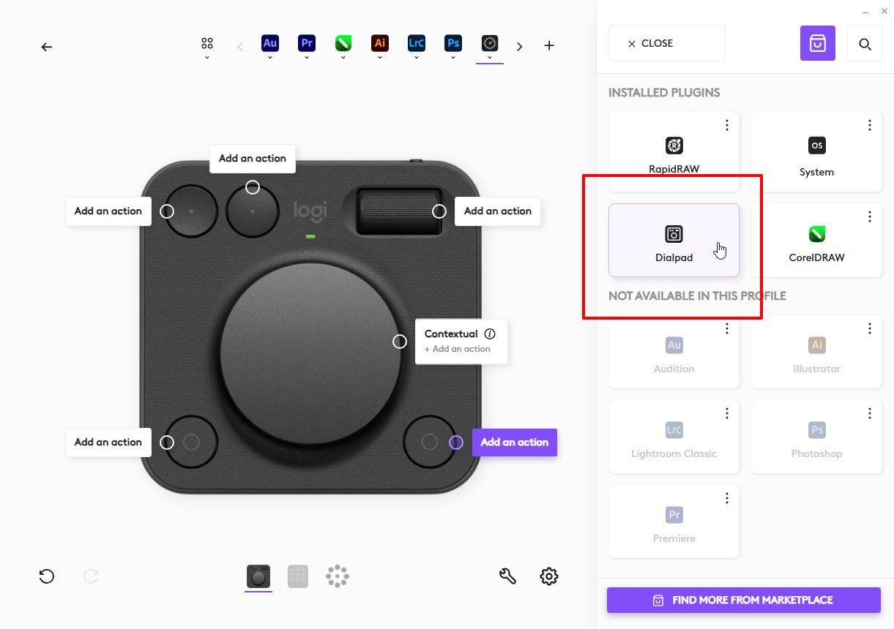

**3. Set up the Actions Ring.** On the Dialpad, the dial can carry a ring of actions that
you flick through; open it to fill the slots.

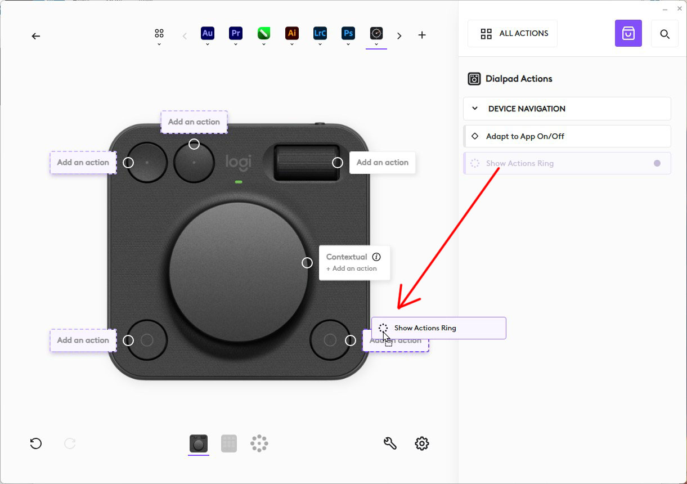

**4. Find the RapidRAW actions.** Actions are grouped by plugin; scroll or search to the
RapidRAW group.

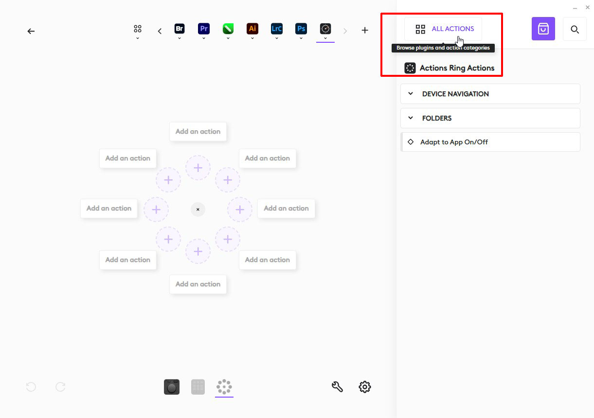

**5. Choose RapidRAW.** `RapidRAW → Develop` holds the ~110 sliders (Basic / Color / HSL /
Color grading / Details / Effects / Transform); `RapidRAW → Actions` holds the key
actions (Edit, Image, Rating, Label, View, Reset).

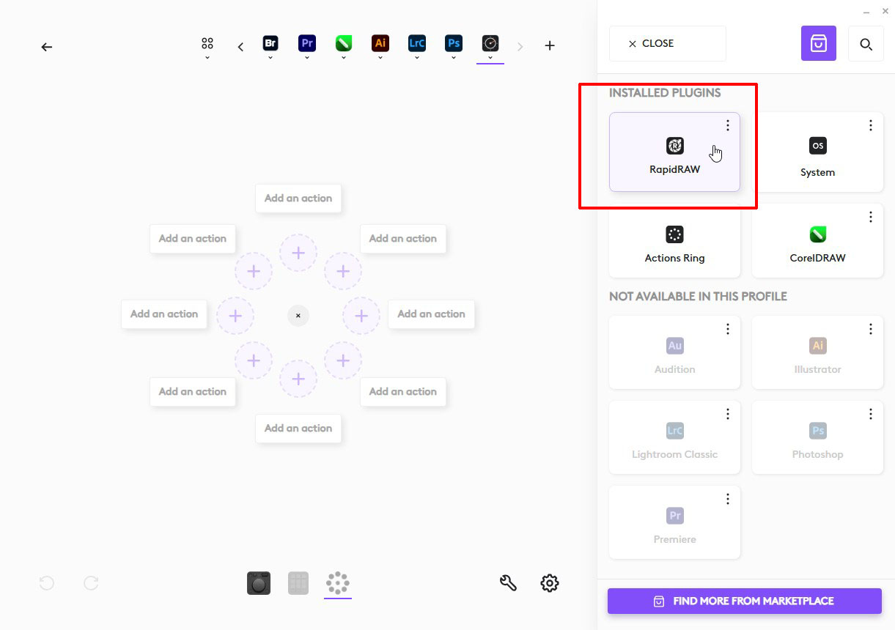

**6. Assign actions.** Drag `Develop → Exposure` (and whatever else you use) onto the
ring slots, the roller, and the buttons.

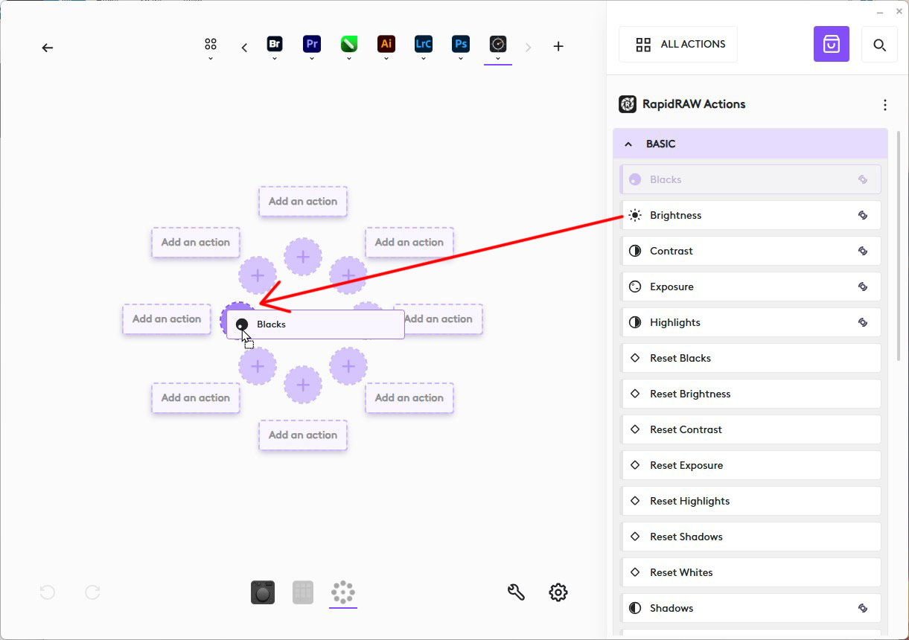

**7. A finished ring.** The plugin's own icons, arranged the way the Lightroom plugin
lays its ring out — Exposure, Contrast, Highlights, Shadows, Whites, Blacks, Temperature,
Tint and so on.

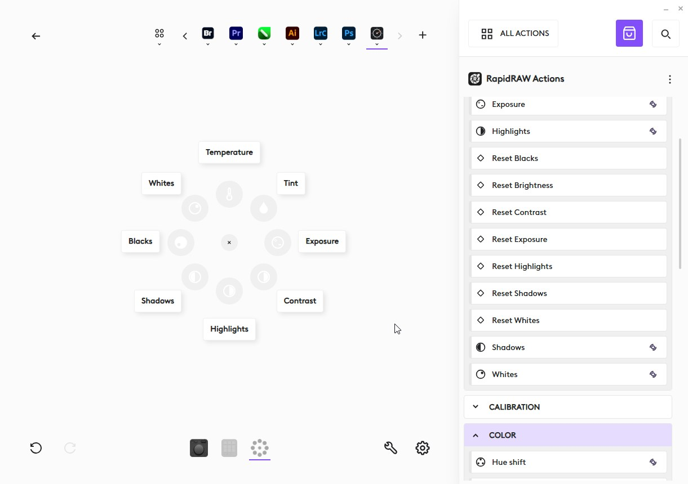

</details>

**8. Using it.** With RapidRAW in front, turn the dial: the preview follows at low
resolution while you turn and renders full quality when you stop; the slider in
RapidRAW's panel moves with it. The dial readout shows the live value (`+0.35 EV`, `-12`,
`180°`), `--` with no image open, `off` when RapidRAW isn't running.

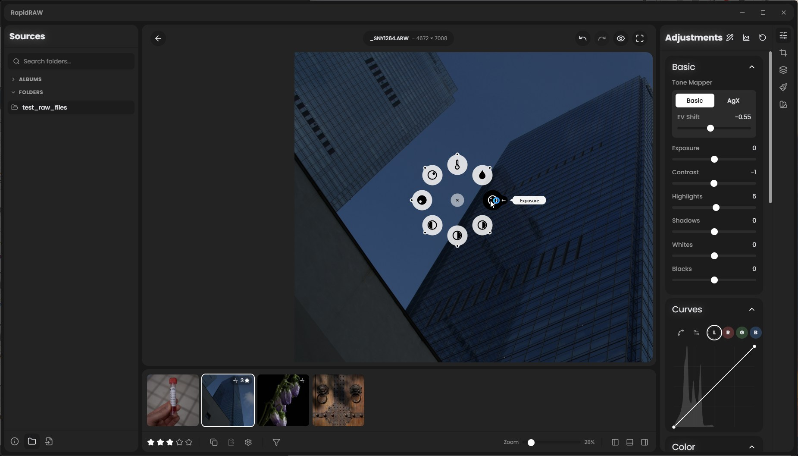

### Resetting a slider: press, then turn

The MX dial cannot be pressed, and Options+ never tells a plugin which ring item is
highlighted, so a reset is a two-step gesture. Put `RapidRAW → Actions → Edit → Reset
(then turn dial)` on one of the Dialpad buttons:

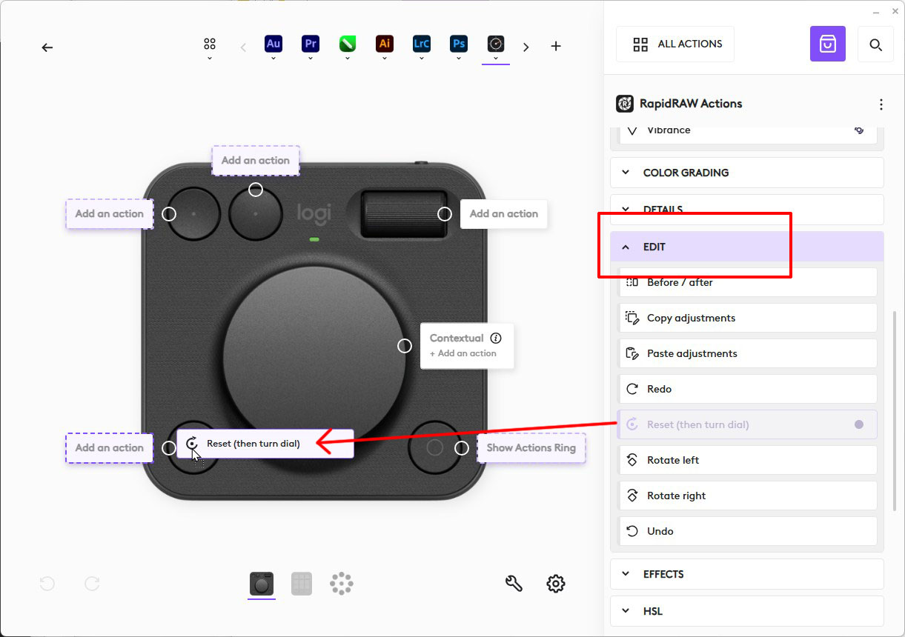

Press it (the key reads `RESET / turn dial`), then move the dial you mean: that first
movement resets the slider to its default instead of adjusting it — one click, no
scrolling back through the range. Nothing within 5 s, or a second press, cancels.

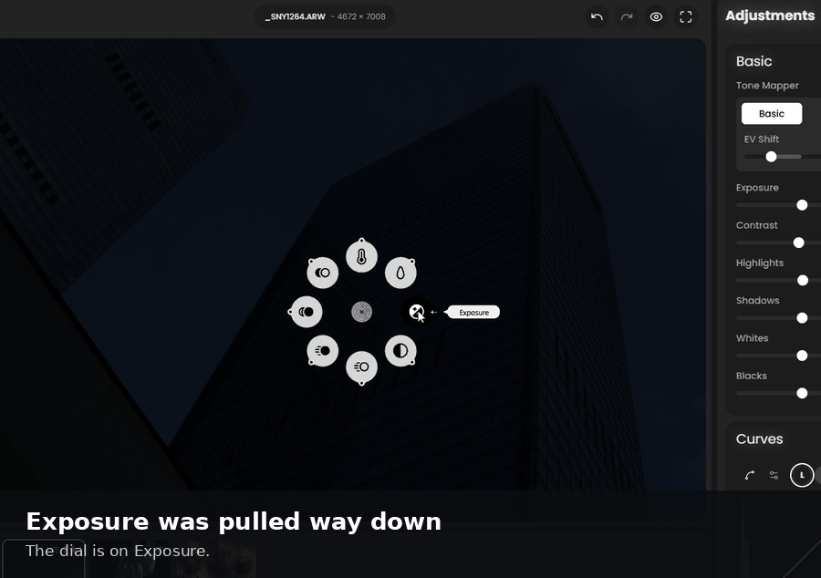

`Actions → Reset → Basic/Color/Details` has fixed per-slider reset keys too. On devices
whose dials do press (Loupedeck CT/Live), the press resets directly.

A few more things worth knowing:

* **Keypad / Actions Ring keys**: `RapidRAW → Actions` — Undo, Redo, Before/after,
  Previous / Next image, Rate 0–5, Label red…purple, Zoom fit / 100 %, panel toggles.
  Rating keys show the current stars. Every action is the same handler RapidRAW's own
  keyboard shortcut uses, guards included (Next image does nothing in the library view).
* **Sensitivity**: Exposure and Brightness move 0.05 EV per detent, everything else one
  native step; a fast spin gets the SDK's acceleration on top. Two knobs in
  `src/RapidRawAdjustments.cs`: `SdkDiffPerDetent` (how much `diff` the SDK reports per
  physical click — the log records every raw value as `dial exposure diff=+2`) and
  per-slider `StepsPerDetent`.

## Installer

`dist\RapidRawPlugin-Setup-<version>.exe` (attached to each GitHub release) is a per-user
install, no admin rights needed. It:

* lets you pick the folder (default `%LOCALAPPDATA%\Programs\RapidRAW Logi Plugin`);
* copies the plugin and writes the `RapidRawPlugin.link` file the Logi Plugin Service uses
  to find it, then asks Options+ to load it — no .NET SDK, no build;
* adds Start Menu shortcuts **Apply Lightroom icons** and **Restore original icons** (and,
  optionally, the same two on the desktop) for the icon swap described next;
* the uninstaller removes the link, the icon backup and the folder.

For installed copies the plugin log is `%TEMP%\logi-rapidraw-plugin.log`.

To build the installer yourself: `tools\build-installer.ps1` does a Release build, reads
the version from `LoupedeckPackage.yaml` and compiles `installer\RapidRawPlugin.iss` with
Inno Setup 6 (`winget install -e --id JRSoftware.InnoSetup`, once). Nothing of Logitech's
is inside the exe.

## Icons

The plugin ships **only its own icons**: 155 white-on-transparent glyphs generated by
`tools/make-icons.py` (a copy lives in `tools/icons-original/`,
`tools/icons-contact-sheet.png` previews them). That is what screenshots 07 and 08 show.

### Optional: swap in the Lightroom Classic by Logi icons

If you would rather the ring looked exactly like Logitech's Adobe plugins, you can copy
their icons over on your own machine. Logitech's icon sets are proprietary ("Lightroom
Classic by Logi" declares `license: Proprietary`), so this is done by you, locally, from a
plugin you installed — never bundled here.

1. In Logi Options+, open the Marketplace and install **Lightroom Classic by Logi**.
   Lightroom itself is not needed, and the Logi plugin can be uninstalled afterwards.
2. Run **Start Menu → RapidRAW Logi Plugin → Apply Lightroom icons** (installer), or from
   a checkout:
   ```
   powershell -ExecutionPolicy Bypass -File tools\use-logi-icons.ps1
   ```
   It finds the installed RapidRAW plugin, backs up its icons to `<plugin>\icons-backup\`,
   copies the matching Lightroom icon over 136 of the 155 actions (Exposure, Contrast,
   every HSL band, colour grading, vignette, grain, perspective, undo/redo, ratings,
   colour labels, zoom, the per-slider resets), keeps the plugin's own icon for the 19
   without a counterpart, and asks Options+ to reload the plugin.
3. To undo: **Restore original icons**, or `tools\use-logi-icons.ps1 -Restore`.

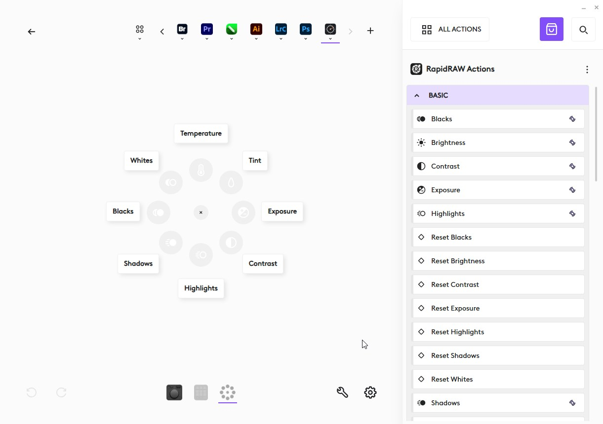

A rebuild (`build-plugin.ps1`) or a plugin update puts the original icons back, so re-run
the swap afterwards if you want the Lightroom look again. `use-logi-icons.ps1` is
Windows-only for now.

### How the icons work

Options+ uses an action's SVG as an alpha mask: only *filled* paths are recoloured
(white on the Actions Ring, dark in the action list); strokes are drawn as-is, which is
why the very first build showed black dots. The convention, taken from the stock Adobe
plugins, is one 32x32 filled-path SVG per action in `src/package/actionsymbols/`
(list / picker) and `src/package/actionicons/` (device / ring), named
`Loupedeck.RapidRawPlugin.<Class>___<parameter>.svg`. `tools/make-icons.py --install`
regenerates them into the package.

## Build and sideload

Only needed if you are changing the plugin; users should take the [installer](#installer).
Prerequisites: Options+ (for `PluginApi.dll`) and the **.NET 10 SDK** (the SDK, not the
runtime — Options+ 6.4 runs on .NET 10; `build-plugin.ps1` reads the exact version the
service runs on and tells you which SDK to install if it is missing).

```
powershell -ExecutionPolicy Bypass -File tools\build-plugin.ps1
```

The script checks every prerequisite with a fix-it message, builds, copies the package
into `bin\Debug\`, writes `%LOCALAPPDATA%\Logi\LogiPluginService\Plugins\RapidRawPlugin.link`
pointing at it, and asks the service to reload the plugin. Re-run it after any C# change —
Options+ picks the new build up without a restart (if it doesn't, quit Options+ from the
tray and reopen). `dotnet clean src\RapidRawPlugin.csproj` removes the sideload. When
running from the sideload, the plugin log is `logs\logi-rapidraw-plugin.log` in this repo.

### macOS

Same prerequisites (Logi Options+ with the plugin service, and the .NET SDK matching the
service's runtime). Then:

```
bash tools/build-plugin.sh            # Debug build + sideload
bash tools/build-plugin.sh --release
bash tools/build-plugin.sh --check-only
```

It finds `PluginApi.dll` inside the LogiPluginService app bundle, writes
`~/Library/Application Support/Logi/LogiPluginService/Plugins/RapidRawPlugin.link`, and
reloads the plugin. The macOS paths (bundle location, `GetBundleName` returning
`io.github.CyberTimon.RapidRAW`) are taken from Tauri's config and the Windows plugin's
csproj comments; they have not yet been exercised on a Mac, so the first run is the test.

## Test without the hardware

```
powershell -ExecutionPolicy Bypass -File tools\smoke-test.ps1
```

Connects to RapidRAW, prints the greeting and parameter table, nudges Exposure +0.5 and
back, rates the open image 3 stars and clears it, and prints the final state. If the
preview moved and the stars toggled, the API works and the plugin will too; if it does not
connect, the problem is on the RapidRAW side, not in Options+.

## Layout

```
src/RapidRawPlugin.cs          Plugin entry: status, client lifetime, armed reset
src/RapidRawApplication.cs     binds the profile to the RapidRAW.exe process
src/RapidRawClient.cs          persistent socket, reconnect, tick coalescing, state cache
src/RapidRawAdjustments.cs     dial actions (PluginDynamicAdjustment), parameter table
src/RapidRawCommands.cs        key actions (PluginDynamicCommand)
src/Diag.cs                    file + service log
src/package/                   LoupedeckPackage.yaml, icon, actionsymbols/, actionicons/
tools/build-plugin.ps1         prerequisite checks + build + sideload (Windows)
tools/build-plugin.sh          same, for macOS
tools/build-installer.ps1      builds dist\RapidRawPlugin-Setup-<version>.exe (Inno Setup)
tools/smoke-test.ps1           protocol test over the socket
tools/make-icons.py            generates the plugin's own action icons (see Icons)
tools/use-logi-icons.ps1       optional, end-user: borrow icons from Lightroom Classic by Logi
installer/                     Inno Setup script + icon
docs/images/                   the screenshots used above
```

## License

MIT. Communicates with RapidRAW (AGPL-3.0) over a socket only; no code linkage.
